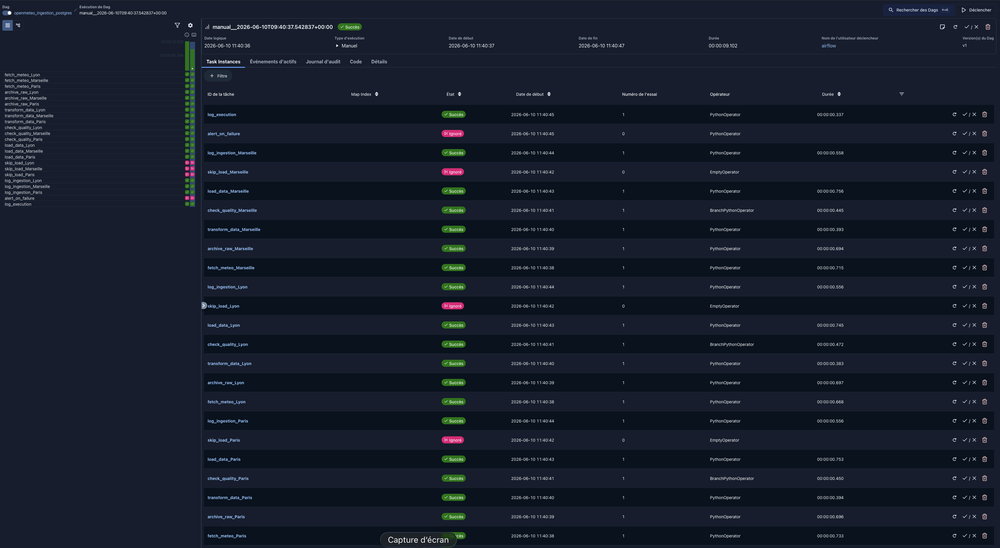
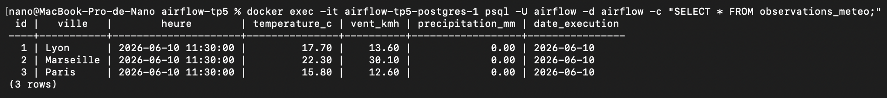
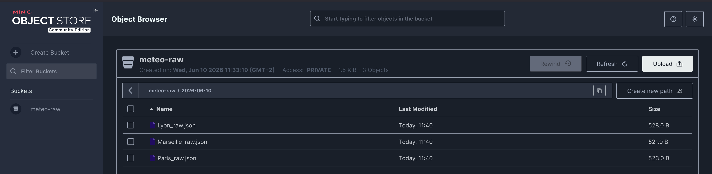
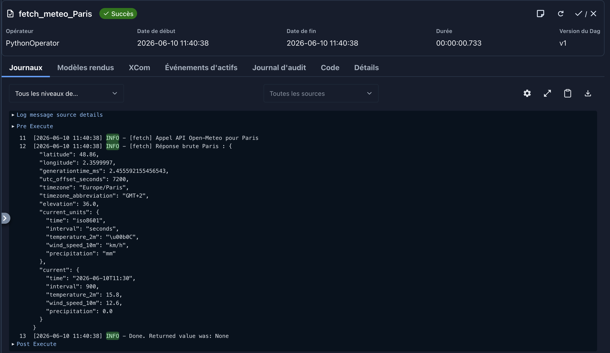
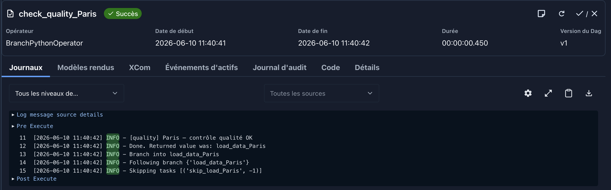
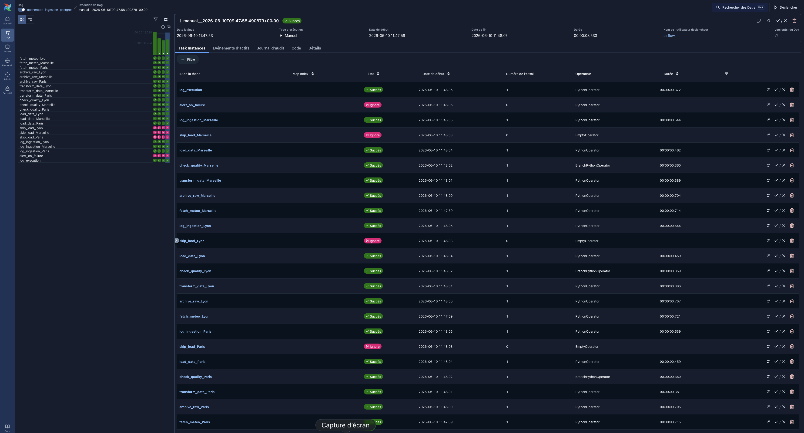
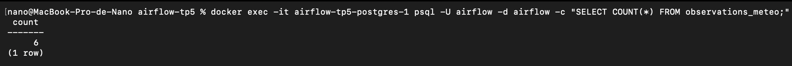
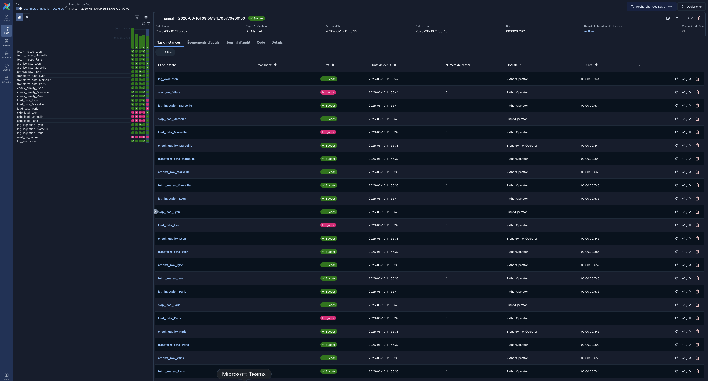
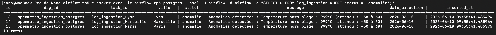
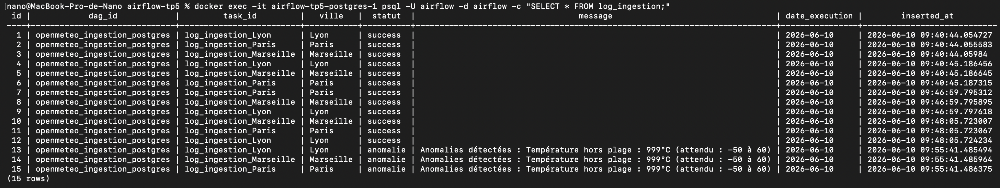

# TP5 — DAG Airflow Complet : OpenMétéo - PostgreSQL

## Description du pipeline

C'est un pipeline Airflow qui récupère les données météo de plusieurs villes via l'API Open-Meteo, les archive, les transforme, contrôle leur qualité, les charge dans PostgreSQL (uniquement si elles sont valides), et trace chaque exécution.

En cas d'anomalie qualité, le chargement est bloqué et l'anomalie est tracée dans la table `log_ingestion`. Le pipeline est conçu pour être relançable sans créer de doublons.

## Schéma du workflow

```
+-------------------+      +-------------------+      +-------------------+
|   fetch_meteo_A   |      |   fetch_meteo_B   |      |   fetch_meteo_C   |
+---------+---------+      +---------+---------+      +---------+---------+
          | Chemin                   | Nominal                  | Nominal
          v                          v                          v
+-------------------+      +-------------------+      +-------------------+
|   archive_raw_A   |      |   archive_raw_B   |      |   archive_raw_C   |
+---------+---------+      +---------+---------+      +---------+---------+
          |                          |                          |
          v                          v                          v
+-------------------+      +-------------------+      +-------------------+
| transform_data_A  |      | transform_data_B  |      | transform_data_C  |
+---------+---------+      +---------+---------+      +---------+---------+
          |                          |                          |
          +-----------------+        |        +-----------------+
                            |        |        |
                            v        v        v
                       +---------------------------+
                       |  check_quality_[A, B, C]  |
                       +-------------+-------------+
                                     |
                    +----------------+----------------+
                    | Branchement conditionnel        | Branchement conditionnel
                    v (Qualité OK)                    v (Anomalie)
         +--------------------+            +--------------------+
         |   load_data_[X]    |            |   skip_load_[X]    |
         +----------+---------+            +----------+---------+
                    |                                 |
                    +----------------+----------------+
                                     | Trigger: all_done
                                     v
                        +-------------------------+
                        |  log_ingestion_[A,B,C]  |
                        +------------+------------+
                                     | Trigger: all_done
                                     v
                        +-------------------------+
                        |      log_execution      |
                        +-------------------------+

Les 3 chaînes (une par ville) s'exécutent en parallèle.
```

## Structure du projet

```
.
├── dags/
│   ├── openmeteo_ingestion_postgres.py ← DAG principal
│   └── modules/
│       ├── __init__.py
│       ├── fetch.py ← récupération API + archivage
│       ├── transform.py ← extraction des champs métier
│       ├── quality.py ← contrôle qualité + branchement
│       └── load.py ← chargement PostgreSQL + traçabilité
├── init_tables.sql ← création des tables
└── README.md
```

## Lancement de l'environnement

```bash
mkdir -p ./dags ./logs ./plugins
curl -LfO 'https://airflow.apache.org/docs/apache-airflow/stable/docker-compose.yaml'
echo -e "AIRFLOW_UID=$(id -u)" > .env
docker compose up airflow-init
docker compose up -d
```

> La commande `echo -e "AIRFLOW_UID=$(id -u)" > .env` concerne les OS Unix (Linux, macOS) pour éviter des problèmes de permissions sur les volumes partagés.

Accéder à l'interface web : [http://localhost:8080](http://localhost:8080) — login `airflow` / `airflow`

## Variables Airflow utilisées (`Admin → Variables`)

| Clé | Valeur |
|---|---|
| `meteo_villes` | `{"Paris": [48.8566, 2.3522], "Lyon": [45.764, 4.8357], "Marseille": [43.2965, 5.3698]}` |
| `meteo_table` | `observations_meteo` |

Ces variables permettent de modifier les villes traitées et la table cible sans toucher au code.

## Connexions Airflow utilisées (`Admin → Connections`)

| ID de Connexion | Type | Hôte | Identifiant | Mot de Passe | Port | Database |
|---|---|---|---|---|---|---|
| `open_meteo_api` | HTTP | `https://api.open-meteo.com` | — | — | — | — |
| `postgres_meteo` | Postgres | `postgres` | `airflow` | `airflow` | `5432` | `airflow` |

| ID de Connexion | Type | Endpoint URL | aws_access_key_id | aws_secret_access_key | 
|---|---|---|---|---|
| `minio_s3` | Amazon Web Services | `http://minio:9000` | *** | *** |

## Déploiement du DAG

```bash
cp -r dags/ ./dags/
```

Le DAG `openmeteo_ingestion_postgres` apparaît dans l'interface web.  
Pour l'exécuter : activer le toggle puis cliquer sur **Déclencher**.

## Description des tâches du DAG

| Tâche | Module | Rôle | Trigger rule |
|---|---|---|---|
| `fetch_meteo_[ville]` | `fetch.py` | Appel HTTP Open-Meteo via `HttpHook` — retourne la réponse brute intégrale | défaut |
| `archive_raw_[ville]` | `fetch.py` | Sauvegarde la réponse brute dans `dags/archive/[ville]_[date]_raw.json` | défaut |
| `transform_data_[ville]` | `transform.py` | Extrait les 4 champs métier et restructure pour la table cible | défaut |
| `check_quality_[ville]` | `quality.py` | Contrôle qualité — branche vers `load_data` ou `skip_load` | défaut |
| `load_data_[ville]` | `load.py` | Insère les données dans PostgreSQL via `PostgresHook` | défaut |
| `skip_load_[ville]` | — | Tâche vide — empêche le chargement si anomalie détectée | défaut |
| `log_ingestion_[ville]` | `load.py` | Écrit une ligne de suivi dans `log_ingestion` | `none_failed_min_one_success` |
| `alert_on_failure` | DAG | Se déclenche si au moins une tâche échoue | `one_failed` |
| `log_execution` | DAG | Trace le bilan global d'exécution dans les logs Airflow | `all_done` |

## Stratégie de robustesse

**Retries** : chaque tâche est configurée avec `retries=2` et `retry_delay=3min` — en cas d'échec (timeout API, indisponibilité réseau), la tâche est relancée automatiquement avant de passer en FAILED.

**Timeout** : l'appel API dans `fetch_meteo` est limité à 10 secondes (`extra_options={"timeout": 10}`). Le DAG applique également un `execution_timeout` de 5 minutes par tâche pour éviter les blocages.

**Gestion des erreurs** : chaque fonction lève des exceptions explicites avec messages descriptifs. Les tâches passent en `UPSTREAM_FAILED` automatiquement si une tâche upstream échoue.

## Stratégie d'idempotence

La table `observations_meteo` possède une contrainte `UNIQUE (ville, heure)`. L'insertion utilise `ON CONFLICT (ville, heure) DO NOTHING` : relancer le DAG sur la même date ne crée aucun doublon.

**Preuve** : exécuter deux fois le DAG sur la même `execution_date` et vérifier que le `COUNT(*)` dans `observations_meteo` reste identique.

## Contrôles qualité mis en place

Effectués dans `check_quality_[ville]` (module `quality.py`) :

| Contrôle | Règle | Comportement si anomalie |
|---|---|---|
| Température | Entre -50°C et +60°C | Branche vers `skip_load` |
| Vitesse du vent | >= 0 km/h | Branche vers `skip_load` |
| Précipitations | >= 0 mm | Branche vers `skip_load` |
| Heure de mesure | Champ non nul | Branche vers `skip_load` |

En cas d'anomalie, les détails sont poussés dans XCom et tracés dans `log_ingestion` avec `statut='anomalie'`.

## Règle de branchement conditionnel

`check_quality_[ville]` est un `BranchPythonOperator`. Il retourne le `task_id` de la prochaine tâche à exécuter :

- `load_data_[ville]` si tous les contrôles qualité passent
- `skip_load_[ville]` si au moins une anomalie est détectée

La tâche `log_ingestion_[ville]` utilise `trigger_rule='none_failed_min_one_success'` pour s'exécuter après l'une ou l'autre branche.

**Simulation d'anomalie** : modifier la Variable `meteo_villes` pour y ajouter une ville avec des coordonnées invalides, ou utiliser la fonction `simulate_anomaly` du module `quality.py` qui force une température à 999°C.

## Description des logs produits

| Préfixe | Niveau | Contenu |
|---|---|---|
| `[fetch]` | INFO | URL appelée, réponse brute reçue |
| `[archive]` | INFO | Chemin du fichier JSON archivé |
| `[transform]` | INFO | Données transformées par ville |
| `[quality]` | INFO / WARNING | Résultat du contrôle, détail des anomalies |
| `[load]` | INFO | Confirmation d'insertion en base |
| `[log_ingestion]` | INFO | Statut final tracé (success / anomalie / failure) |
| `[alert]` | ERROR | Détail de l'échec détecté |
| `[log]` | INFO | Bilan global de l'exécution |

## Description des tables PostgreSQL

**`observations_meteo`** — données météo validées et chargées

| Colonne | Type | Description |
|---|---|---|
| `id` | SERIAL | Clé primaire auto-incrémentée |
| `ville` | VARCHAR(100) | Nom de la ville |
| `heure` | TIMESTAMP | Heure de la mesure (source API) |
| `temperature_c` | NUMERIC(5,2) | Température en °C |
| `vent_kmh` | NUMERIC(6,2) | Vitesse du vent en km/h |
| `precipitation_mm` | NUMERIC(6,2) | Précipitations en mm |
| `date_execution` | DATE | Date du DAG run |

Contrainte d'unicité : `(ville, heure)`, ce qui garantit l'idempotence.

**`log_ingestion`**, permet la traçabilité de chaque exécution par ville

| Colonne | Type | Description |
|---|---|---|
| `id` | SERIAL | Clé primaire |
| `dag_id` | VARCHAR(200) | Identifiant du DAG |
| `task_id` | VARCHAR(200) | Identifiant de la tâche |
| `ville` | VARCHAR(100) | Ville concernée |
| `statut` | VARCHAR(20) | `success`, `anomalie` ou `failure` |
| `message` | TEXT | Détail de l'anomalie ou de l'erreur |
| `date_execution` | DATE | Date du DAG run |
| `inserted_at` | TIMESTAMP | Horodatage d'insertion automatique |

## Preuves

### Cas nominal




### Logs Airflow



### Cas de relance (idempotence)




### Cas anomalie qualité



### Contenu du log d'exécution global


## Limites

- La simulation d'anomalie qualité nécessite une modification manuelle du code (`simulate_anomaly` dans `quality.py`). En production, ce serait déclenché par des données réellement invalides.
- L'API Open-Meteo retourne toujours des données valides dans des conditions normales, les anomalies qualité ne peuvent être démontrées que par simulation.
- Le pipeline ne gère pas la déduplication sur `log_ingestion` : des relances multiples sur la même date créeront plusieurs lignes de log (comportement intentionnel pour la traçabilité).
